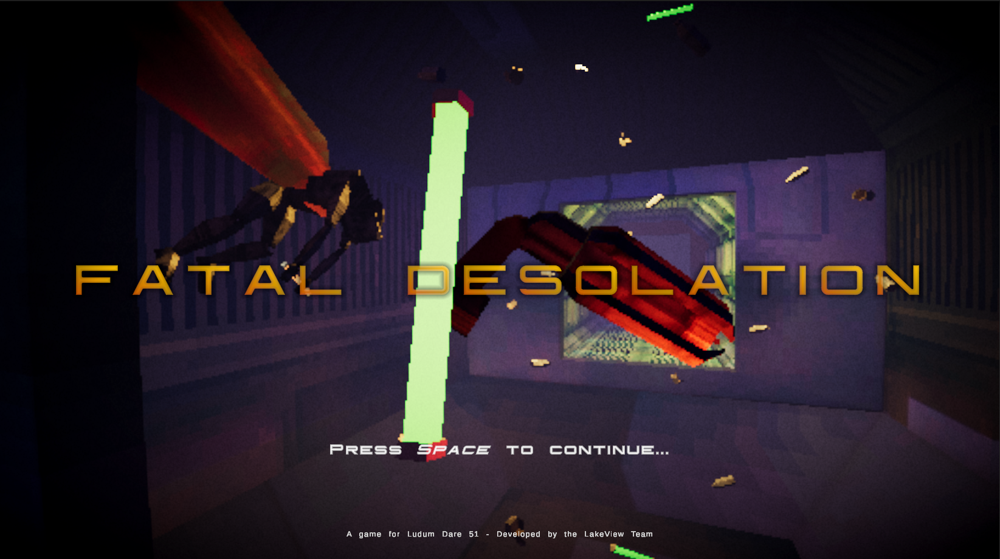

# lakeviewjamteam
the repo for the people of lakeview doing a jam

## TO DO

- Add credit

## IN PROGRESS

## DONE
### Player Movement
+ Reworked for new input system
+ Added axes inversion supped
+ Simplified and polished movement  

### Player GUN
+ Line renderer need to be put in the handlayer rendering to be well positioned + needed to set both camera with the same fovea
+ Laser impact and particle
+ Change laser collision detection - too difficult to shot with gamepad otherwise
+ [CANCELLED] ~~Make shot recoil based on shoot direction~~
	+ We need gameplay parity with gamepad

### Gamepad Support
+ Replace legacy input system with the new one
	+ Rotate
	+ Roll
	+ Fire
+ Additional reworks for gamepad
	+ Aim anim
	+ Cursor
+ Splitted ControlScheme for Gameplay and UI 
+ Updated UI to adapt to current controller device 

### Settings
+ Add Pause & Settings

### UI
+ Main Menu
+ Add Restart support with new input system

### Levels improvement
+ Add more content to the boss room
+ Add recoil tutorial to level 1

### DEPLOYED LATEST BUILD!

## What I learned
- Can't use PlayerInput behavior to send both Inspector Unity event and C# event
- To make a UI background to fit it's inner text, add an `Horizontal Layout Group` component (with both `Control child Size` `Width` and `Height` set to true) and a `Content Size Fitter` with both fit set to `Preferred Size`.  